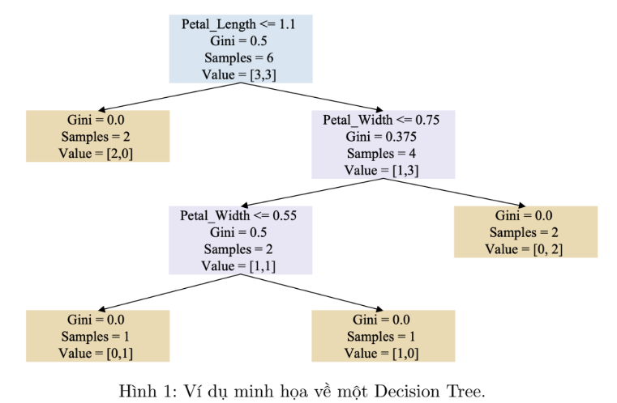
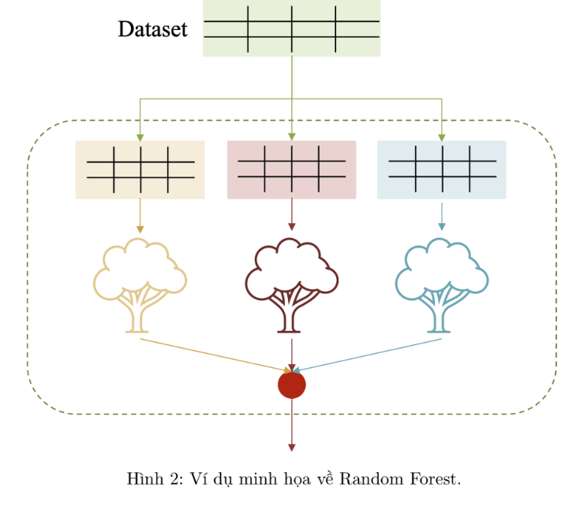
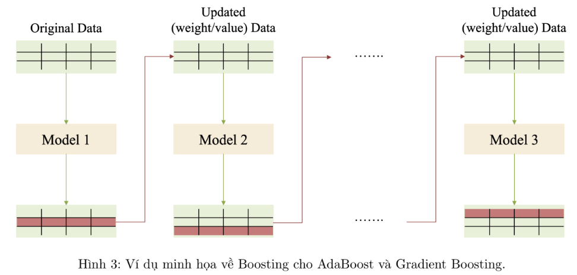

# Ensemble Learning

- Trong bài tập này, chúng ta sẽ thực hành các nội dung liên quan đến Decision Tree, Random Forest, AdaBoost và Gradient Boosting áp dụng cho bài toán Regression. Trong Machine Learning, bài toán regression là dạng bài toán mà kết quả đầu ra của mô hình là một giá trị liên tục.

## Decision Tree (DT):

- Là một thuật toán Machine Learning theo kiểu Supervised Learning có thể dùng để giải quyết cho hai dạng bài toán là Regression và Classification.
- DT xây dựng một cấu trúc dạng cây, với các node đại diện cho quyết định dựa trên một điều kiện của đặc trưng nào đó. Sau khi trải qua một loạt quyết định, kết quả dự đoán cuối cùng chính là giá trị mà node lá nắm giữ.

## Random Forest (RF):

- Là một thuật toán Machine Learning theo kiểu Ensemble Learning có thể dùng để giải quyết cho hai dạng bài toán là Regression và Classification.
- Ý tưởng của RF liên quan đến việc sử dụng nhiều DT, mỗi cây sẽ học trên một tập con của một bộ training dataset (Boostrap).
- Khi thực hiện dự đoán, mỗi cây sẽ đưa ra kết quả dự đoán của mình, sau đó tổng hợp toàn bộ kết quả lại theo một cách thức nào đó (ví dụ: lấy trung bình với bài Regression hay thực hiện biểu quyết với bài Classification) để trả về kết quả cuối cùng.

## AdaBoost (AB) và Gradient Boosting (GB):

- Là hai mô hình điển hình cho kiến trúc tiếp cận Ensemble Learning, thay vì các mô hình được học song song nhau trên các tập con dataset, thì với 2 phương pháp này sẽ được học theo trình tự. Mô hình sau sẽ học kế thừa từ tri thức của mô hình trước.
