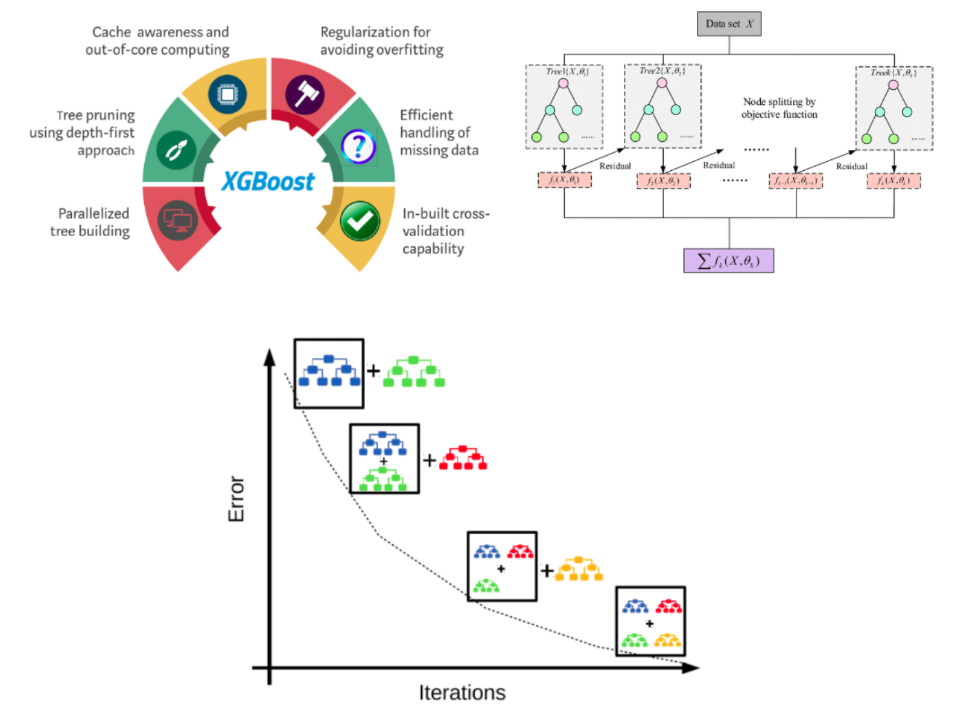

# XGBoost

- XGBoost là viết tắt của "Extreme Gradient Boosting", một thuật ngữ có nguồn gốc từ bài báo có tiêu đề "Greedy Function Approximation: A Gradient Boosting Machine" của Friedman. 
- Thuật toán này được sử dụng trong các tình huống học có giám sát nơi chúng ta sử dụng dữ liệu với nhiều thuộc tính để dự báo một biến kết quả. 
- Kể từ khi ra mắt vào năm 2014, XGBoost đã trở thành kỹ thuật học máy được ưa chuộng cho nhiều chuyên gia trong lĩnh vực này.

## XGBoost for Regression
- Các nhiệm vụ hồi quy (regression) nhằm dự đoán một biến đầu ra liên tục dựa trên một hoặc nhiều biến đầu vào.
- Trong bối cảnh của XGBoost, các vấn đề hồi quy được tiếp cận bằng cách sử dụng các trees nơi mà các leaf đại diện cho các giá trị đầu ra có tính chất liên tục. 
- Một trong những điểm mạnh của XGBoost trong hồi quy là khả năng mô phỏng các mối quan hệ phi tuyến mà không cần phải biến đổi các đặc trưng. 
- Thêm vào đó, việc kết hợp regularization vào hàm mất mát của nó gíup cho XGBoost có thể chống lại việc overfit tốt hơn so với các mô hình hồi quy truyền thống. 
- Điều này làm cho nó được chú trọng hơn trong các tình huống mà dữ liệu có nhiều đặc trưng hoặc khi mô hình trở nên quá phức tạp.
- Các bước thực hiện:
    1. Khởi tạo giá trị $f_0$ dự đoán của model bằng cách lấy giá trị trung bình của $Y$ (giá trị của target)
    2. Tính Similarity Score của root
        $$\text{Similarity Score} = \frac{(\text{Sum of Residuals})^2}{\text{Number of Residuals} + \lambda} $$
        - $\text{Sum of Residuals}$ là tổng của cá giá trị $Y$ trong $f_0$.
        - $\text{Number of Residuals}$ là số lượng sample.
        - $\lambda$ là hệ số regularization.
    3. Có nhiều cách chọn điều kiện root, cơ bản nhất là lấy trung bình của 2 sample liên tiếp nhau. Sau đó tính Similarity Score cho các node trong nhánh trái và nhánh phải
    4. Tính Gain cho từng điều kiện của root đã chọn ở trên và chọn ra Gain có giá trị lớn nhất
        $$Gain = \text{Left Similarity Score} + \text{Right Similarity Score} - \text{Root Similarity Score}$$
    5. Tuỳ vào điều kiện độ sâu của tree mà ta sẽ thực hiện chia nhánh bằng cách lặp lại Step 2 đến Step 4. Sau đó ta đi tìm output cho root theo điều kiện có gain lớn nhất:
        $$Output = \frac{\text{Sum of Residuals}}{\text{Number of Residuals}}$$
        - $\text{Sum of Residuals}$ là tổng của các giá trị $Y$ - $f_0$.
        - $\text{Number of Residuals}$ là số lượng sample.
    6. Dùng công thức sau $f_0 + lr \times \text{Output}$ để dự đoán kết quả cho toàn bộ training sample
    (thay thế cho f0) và tiếp tục thực hiện step 2 đến step 5 cho đến khi thoả mãn điều kiện
    dừng
   
## XGBoost for Classification
- Các nhiệm vụ phân loại (classification) liên quan đến việc dự đoán các nhãn hoặc danh mục rời rạc (labels) dựa trên các đặc trưng đầu vào. 
- Trong phân loại nhị phân, XGBoost xuất ra một điểm xác suất cho biết khả năng của một sample thuộc về một class cụ thể. Xác suất này sau đó dựa trên một ngưỡng nhất định, thường ở mức 0.5, để gán nhãn lớp.
- Các bước thực hiện:
    1. Khởi tạo giá trị $f_0$ dự đoán của model thông thường là 0.5 (xác suất của dự đoán)
    2. Tính Similarity Score của root
        $$\text{Similarity Score} = \frac{(\text{Sum of Residuals})^2}{\sum{[\text{Previous Probabilities}} \times (1 - \text{Previous Probabilities})] + \lambda} $$
        - $\text{Sum of Residuals}$: tổng các giá trị trong $Y$ (ở dạng xác suất) - $f_0$
        - $\text{Previous Probabilities}$: xác suất của model trước dự đoán, ví dụ ở đây là 0.5
        - $\lambda$: hệ số regularization
    3. Có nhiều cách chọn điều kiện root, cơ bản nhất là lấy trung bình của 2 sample liền kề. Sau đó tính Similarity Score cho các node trong nhánh trái và nhánh phải
    4. Tính Gain cho từng điều kiện của root đã chọn ở trên và chọn ra Gain có giá trị lớn nhất
        $$Gain = \text{Left Similarity Score} + \text{Right Similarity Score} - \text{Root Similarity Score}$$
    5. Tuỳ vào điều kiện độ sâu của tree mà ta sẽ thực hiện chia nhánh bằng cách lặp lại
    Step2 đến Step4. Sau đó ta đi tìm output cho root theo điều kiện có gain lớn nhất
        $$Output = \frac{\text{Sum of Residuals}}{\sum{[\text{Previous Probabilities}} \times (1 - \text{Previous Probabilities})]}$$
    6. Dùng công thức bên dưới để dự đoán kết quả (Probability) cho toàn bộ training sample (thay thế cho f0) và tiếp tục thực hiện step 2 đến step 5 cho đến khi thoả mãn điều kiện dừng
        - Cần chọn nhánh phù hợp theo giá trị của $X$.
        - Khi chọn được nhánh phù hơp ta tính Log prediction theo công thức
            $$\text{Log Prediction} = \log(\frac{Previous Probabilities}{1 - Previous Probabilities})+lr*Output$$
        - Xác suát dự đoán của các sample được tính theo công thức
            $$\text{Probability} = \frac{e^{\log(\text{Log Prediction})}}{1+e^{\log(\text{Log Prediction})}}$$
