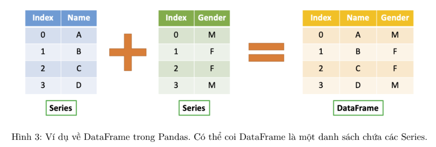

# Pandas

## 1. Series


- Cấu trúc là 1D với dữ liệu đồng nhất, loại dữ liệu có thể là int, float, string, boolean, ...
- Có index và value
- Kích thước series ko đổi (immutable) và giá trị dữ liệu có thể thay đổi (mutable)
- Có thể tạo Series từ list, dict, numpy array, ...

```text
pandas.Series(data, index, dtyp, copy)

Trong đó:
- data: dữ liệu đầu vào, có thể là ndarray, list, dict, ...
- index: Giá trị index phải là unique, hashable và có kích thước bằng data, giá trị mặc định là range(len(data))
- dtype: kiểu dữ liệu của dữ liệu đầu vào, mặc định là float64
- copy: boolean, nếu True thì copy dữ liệu đầu vào, mặc định là False
```

## 2. DataFrame



- Cấu trúc là 2D, có dạng bảng gồm các cột và các hàng, loại dữ liệu có thể là int, float, string, boolean, ...
- 1 cột DataFrame là Series

```text
pandas.DataFrame(data, index, columns, dtype, copy)

Trong đó:
- data: dữ liệu đầu vào, có thể là ndarray, series, constants, list, dict, ... và DataFrame khác
- index: Giá trị index phải là unique, hashable và có kích thước bằng data, giá trị mặc định là range(len(data))
- columns: tên cột, có thể là list, dict, ...
- dtype: kiểu dữ liệu của dữ liệu đầu vào, mặc định là float64
- copy: boolean, nếu True thì copy dữ liệu đầu vào, mặc định là False
```

## 3. Panel


- Cấu trúc là 3D, có dạng bảng gồm các cột, hàng và mặt, loại dữ liệu có thể là int, float, string, boolean, ...
- 1 cột Panel là DataFrame

```text
pandas.Panel(data, items, major_axis, minor_axis, dtype, copy)

Trong đó:
- data: dữ liệu đầu vào, có thể là ndarray, series, constants, list, dict, ... và DataFrame khác
- items: axis 0, có thể là list, dict, ...
- major_axis: axis 1, có thể là list, dict, ...
- minor_axis: axis 2, có thể là list, dict, ...
- dtype: kiểu dữ liệu của dữ liệu đầu vào, mặc định là float64
- copy: boolean, nếu True thì copy dữ liệu đầu vào, mặc định là False
```

## 4. Các hàm thường dùng

- Handle missing values: `.isna()`, `.notna()`, `.isnull()`, `.notnull()`
- Handle duplicate values: `.drop_duplicates()`
- Handle categorical values: `.astype()`
- Handle date and time: `.to_datetime()`
- Handle string values: `.str.replace()`, `.str.contains()`, `.str.startswith()`, `.str.endswith()`, ...
- Handle numeric values: `.fillna()`, `.dropna()`, ...
- Indexing and slicing in Pandas: `.loc` (label based), `.iloc` (integer based), `.ix` (label or integer based)
- Group by: `.groupby()`
- Các query như excel hay SQL: `.query()`, `.where()`, ...
- Sort: `sort_values()`, `sort_index()`
- Series basic: `.axes`, `.dtype`, `.shape`, `.size`, `.values`, `.index`, `.name`, `.head()`, `.tail()`, ...
- DataFrame basic: `.T`, `.axes`, `.dtype`, `.shape`, `.size`, `.values`, `.index`, `.name`, `.head()`, `.tail()`, ...
- Thống kê: `.describe()`, `.mean()`, `.median()`, `.mode()`, `.sum()`, `.count()`, `.min()`, `.max()`, `.std()`, `.var()`, `.corr()`, `.cov()`, `.rank()`, `.skew()`, `.apply()`, ...
- Filter data: `.groupby()`, `.get_group()`, `.merge()`, `.join()`, `.pivot_table()`, `.melt()`, `.stack()`, `.unstack()`, ...
