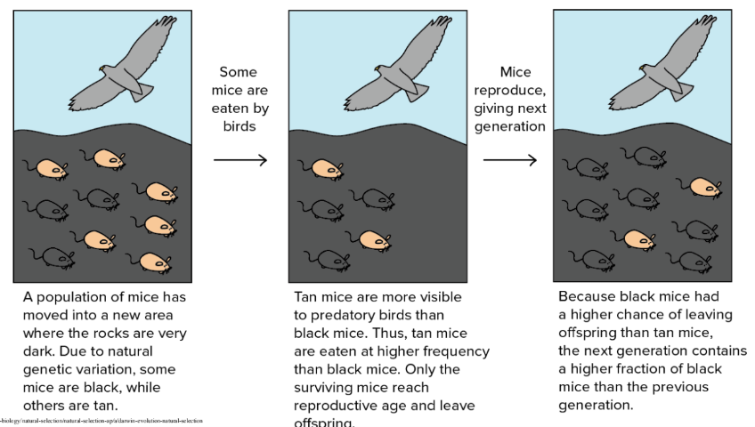
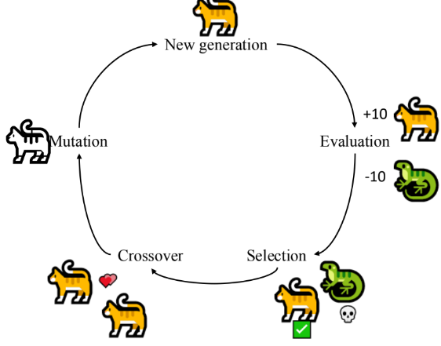
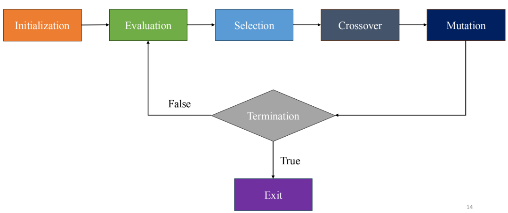
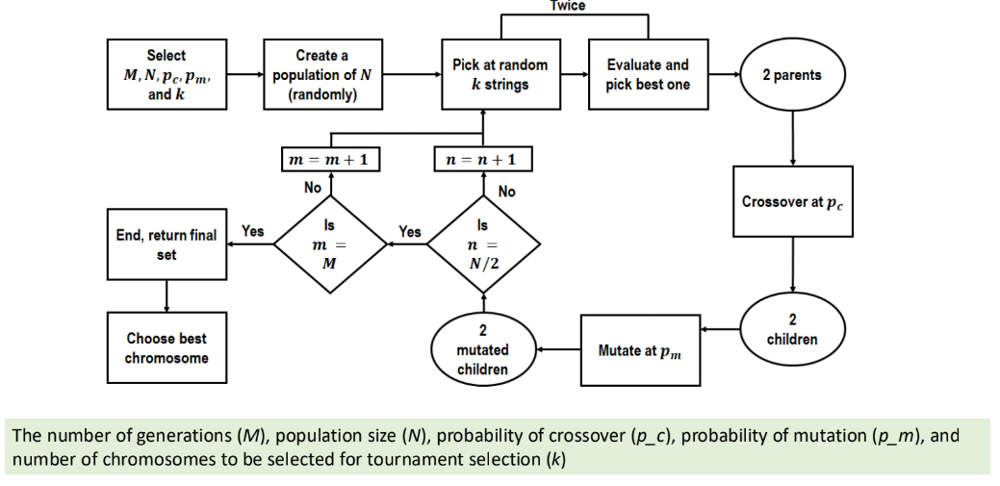

# Genetic Algorithm

## 1. Introduction
- Genetic Algorithm là một kỹ thuật tìm kiếm và tối ưu hóa trong Evolutionary Algorithms, lấy cảm hứng từ quá trình chọn lọc tự nhiên, nơi một quần thể các giải pháp ứng viên tiến hóa theo thời gian.
- Bắt chước quá trình natural selection, tức là các species có khả năng thích nghi với những thay đổi trong môi trường sẽ có thể endure, procreate và pass on their genes cho thế hệ sau.

## 2. Genetic Algorithm
### Ý tưởng

### Các bước
- Pipeline đơn giản

- Cụ thể

    - (a) Initial Population: Khởi tạo quần thể (population) một cách ngẫu nhiên
    - (b) Fitness function: Hàm đánh giá độ tốt của một cá thể. Giá trị càng lớn thì cá thể càng tốt.
    - (c) Selection: Bước chọn lọc những cá thể tốt trong quần thể
    - (d) Cross-over: Bước lai tạo (trao đổi gen) giữa các cá thể.
    - (e) Mutation: Bước đột biến cho một cá thể (thay đổi gen một cách ngẫu nhiên)
    - Giải thuật GAs thực hiện bước (a) một lần ban đầu, và các bước từ (b) đến (e) được thực hiện cho mỗi generation.

