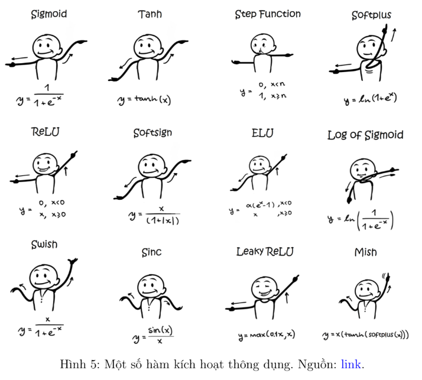

# Multi-Layer Perceptron (MLPs) and Activation Functions

- Multilayer Perceptrons (MLPs) là một kiến trúc mạng nơ-ron trong lĩnh vực học sâu (deep learning) với cấu tạo gồm 3 thành phần chính: 
    - Lớp đầu vào (Input layer)
    - Lớp ẩn (Hidden layer)
    - Lớp đầu ra (Output layer)
- Mỗi lớp ẩn sử dụng hàm kích hoạt (Activation functions) để mô hình có thể học các mối quan hệ phức tạp giữa đầu vào và đầu ra.
- MLPs thường được dùng trong các bài toán phân loại, hồi quy và các tác vụ học sâu khác trên các bộ dữ liệu có phân bố phức tạp.

## 1. Một số ký hiệu

- $x$: vector đầu vào (features)
- $y$: vector đầu ra (labels)
- $\hat{y}$: vector đầu ra dự đoán (predictions)
- $W$: ma trận trọng số (nhiệm vụ của training là tìm bộ $W$ để $y\approx\hat{y}$)
- $b$: vector bias
- $a$: vector đầu ra của hàm kích hoạt
- Loss: hàm mất mát (có thể hiểu là độ chênh lệch giữa $y$ và $\hat{y}$, là mục tiêu của training)
- $f(\cdot)$: hàm kích hoạt (activation function)
- $m$: số lượng mẫu dữ liệu trong 1 batch
- $n$: số lượng features
- $C$: số lượng classes

## 2. Linear Regression: Sử dụng cho regression task (ví dụ dự đoán giá nhà)
$$\hat{y} = W^Tx = w_0 + w_1x_1 + w_2x_2 + \cdots + w_nx_n$$

- Loss thường được dùng là MSE (Mean Squared Error):
$$L(y,\hat{y}) = \frac{1}{m}\sum_{i=1}^{m}(y_i - \hat{y}_i)^2$$

## 3. Softmax Regression: Sử dụng cho classification task
$$\hat{y} = f(W^Tx) = f(w_0 + w_1x_1 + w_2x_2 + \cdots + w_nx_n)$$

- Đối với bài toán binary classification, ta sẽ sử dụng hàm sigmoid:
$$f(x) = \frac{1}{1+e^{-x}}$$

- Đối với bài toán multi-class classification, ta sẽ sử dụng hàm softmax:
$$f(x) = \frac{e^{x_i}}{\sum_{j=1}^{C}e^{x_j}}$$

- Loss thường được dùng là Cross-Entropy với các class ở dạng one-hot encoding, công thức tính loss cho 1 mẫu duy nhất (1 sample) như sau:
$$L(y,\hat{y}) = -\sum_{c=1}^{C}y_c\log(\hat{y}_c)$$

## 4. MLPs
- Như ta đã biết, MLP thông thường có 3 loại layer: Input layer, Output layer, và Hidden layer. 
- Có thể có nhiều Hidden layer và thường được bắt đầu từ 1 (số lượng hidden layer càng nhiều thì model càng deep). 
- Mỗi layer sẽ có nhiều node (hình tròn), với Input layer là số lượng features, Output layer là số lượng node dùng cho output (ví dụ bài toán classification phân loại 3 classes thì cần 3 nodes), và mỗi Hidden layer là số lượng neuron tham gia vào trích xuất đặc trưng của layer đó. Loss sẽ tùy thuộc vào từng bài toán mà sẽ có function cụ thể.

### 4.1 Forward
- Thông tin sẽ đi theo chiều từ Input layer đến Output layer. Tại mỗi layer $l$ của các Hidden layer, thông tin đầu vào sẽ là output từ layer $l-1$ gọi là $a^{[l-1]}$. Tại mỗi layer $l$, ta sẽ có:

    $$a^{[l]} = f(z^{[l]}) = f(W^{[l]T}a^{[l-1]} + b^{[l]})$$

    - Với $z^{[l]}$ là tổng của tích của $W^{[l]T}$ và $a^{[l-1]}$ và $b^{[l]}$:
    $$z^{[l]} = W^{[l]T}a^{[l-1]} + b^{[l]}$$
    
    - Với $W^{[l]}$ là ma trận trọng số của layer $l$, $b^{[l]}$ là vector bias của layer $l$.
    - $f(\cdot)$ là hàm kích hoạt (activation function) của layer $l$.
    - $a^{[l]}$ là output của layer $l$.
- Việc này lặp lại cho đến khi đi qua hết các layer và ra output cuối cùng.

### 4.2 Backward
- Lúc này hàm Loss sẽ được dùng để tính toán sự sai lệch giữa $y$ và $\hat{y}$. Dựa vào thông tin này để gửi phản hồi theo chiều từ Output layer đến Input layer để điều chỉnh các tham số trong mỗi layer (quá trình này là backpropagation).
- Thông tin phản hồi về chính là gradient và được tính toán dựa vào đạo hàm và chain rule:
    $$\frac{\partial L}{\partial W^{[l]}} = \frac{\partial L}{\partial a^{[l]}} \cdot \frac{\partial a^{[l]}}{\partial z^{[l]}} \cdot \frac{\partial z^{[l]}}{\partial W^{[l]}}$$

    - $\frac{\partial L}{\partial a^{[l]}}$ là gradient của loss với $a^{[l]}$
    - $\frac{\partial a^{[l]}}{\partial z^{[l]}}$ là gradient của $a^{[l]}$ với $z^{[l]}$
    - $\frac{\partial z^{[l]}}{\partial W^{[l]}}$ là gradient của $z^{[l]}$ với $W^{[l]}$

- Sau đó sử dụng gradient descent để update weights
    $$W^{[l]} = W^{[l]} - \eta \frac{\partial L}{\partial W^{[l]}}$$

    - $\eta$ là learning rate
    - $\frac{\partial L}{\partial W^{[l]}}$ là gradient của loss với $W^{[l]}$
    - $W^{[l]}$ là ma trận trọng số của layer $l$

### 4.3 Activation Function
- Là các hàm toán học được áp dụng cho đầu ra của các nơ-ron trong MLP, với ý nghĩa chính là `giúp MLP đưa ra quyết định có nên kích hoạt nơ-ron hay không`. 
- Nó giúp chuyển đổi đầu ra tuyến tính của một lớp thành một dạng phi tuyến, cho phép mạng nơ-ron học được các quan hệ phức tạp hơn.

- Các hàm kích hoạt thường được sử dụng:
    - Sigmoid:
    $$f(x) = \frac{1}{1+e^{-x}}$$
    - ReLU:
    $$f(x) = \max(0,x)$$
    - Tanh:
    $$f(x) = \frac{e^x - e^{-x}}{e^x + e^{-x}}$$
    - Softmax:
    $$f(x) = \frac{e^{x_i}}{\sum_{j=1}^{C}e^{x_j}}$$

