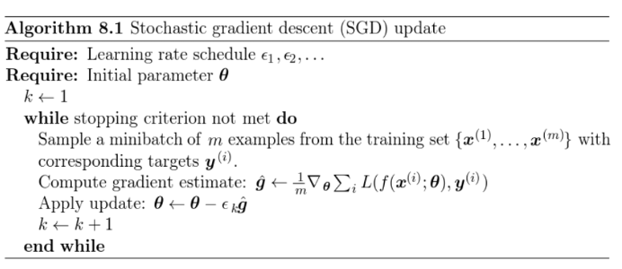
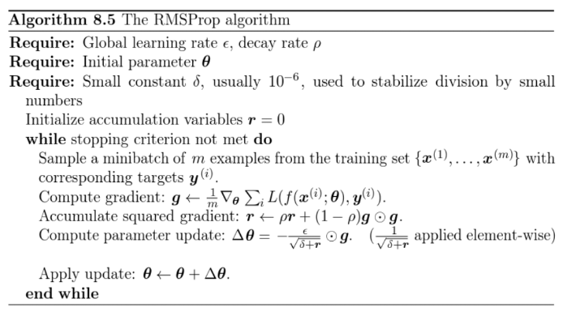
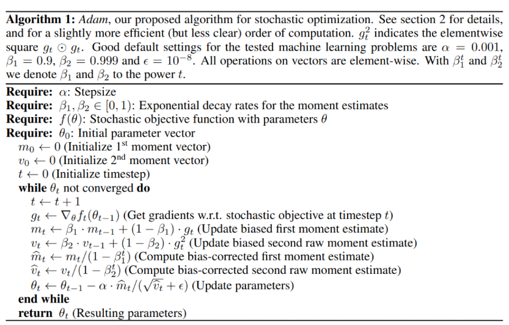

# Optimization Algorithms in Deep Learning

## 1. Gradient Descent
- Là thuật toán đi tìm điểm minimum của một function dựa trên tính toán gradient của function đó. 
- Function này phải thỏa mãn điều kiện là liên tục và có thể đạo hàm được phần lớn ở mọi nơi. 
- Phương pháp này ta sẽ chọn một điểm xuất phát ngẫu nhiên (1 điểm bất kỳ trên function) sau đó dựa vào độ dốc và hướng của gradient để đi ngược hướng và tiến về nơi có vị trị thấp hơn, việc này được lặp đi lặp lại cho đến khi tìm được điểm minimum hoặc thỏa mãn điều kiện dừng

## 2. Gradient Descent + Momentum
- Phương pháp này khắc phục điểm yếu của Gradient Descent là không thể vượt qua local minimum để tiến về điểm local minimum khác thấp hơn. 
- Gradient Descent + Momentum sử dụng exponentially weighted average gradient để tích lũy gradient từ trước đó và kết hợp với gradient hiện tại giúp tạo ra một giá trị đủ lớn vượt qua local minimum hiện tại và tiến về local minimum tốt hơn. 
- Nó hoạt động tương tự như viên bi có khi lăn xuống kết hợp thêm đà (momentum) để vượt qua dốc và rơi vào nơi tốt hơn.

$$v_{t} = \beta v_{t-1} + (1 - \beta) dW_i$$

$$W_{t} = W_{t-1} - \alpha v_{t}$$

## 3. RMSprop
- Đây là thuật toán mở rộng từ AdaGrad và cũng sử dụng gradient từ trước để tạo ra một thuật toán có thể adaptive learning rate thay vì learning rate cố định như các thuật toán trước. 
- Ý tưởng chính của RMSProp là sử dụng exponentially weighted average bình phương gradient và chia gradient với căn bậc hai của average này.

$$v_{t} = \beta v_{t-1} + (1 - \beta) dW_i^2$$

$$W_{t} = W_{t-1} - \alpha \frac{dW_i}{\sqrt{v_t} + \epsilon}$$

## 4. Adam
- Có thể xem Adam là thuật toán sử dụng kết hợp ý tưởng của Momentum và RMSProp
- vì Adam sử dụng exponentially weighted average gradient và exponentially weighted average bình phương gradient. 
- Cách thức Adam hoạt động theo việc thừa hưởng điểm mạnh của momentum và adaptive learning rate, momentum giúp vượt qua các local minimum để tiến đến các local minimum tốt hơn, trong khi adaptive learning rate giúp cho việc hội tụ nhanh hơn thay vì phải mất một khoảng thời gian để dao động xung quanh điểm hội tụ.

