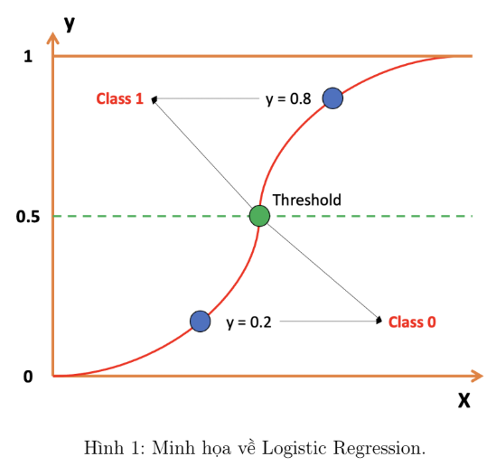
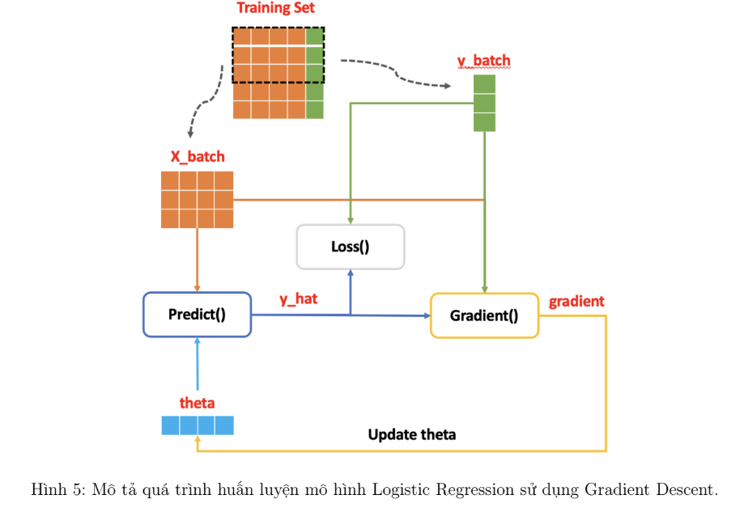

# Logistic Regression

- Logistic Regression là một trong những thuật toán supervised-learning Machine Learning nền tảng quan trong nhất, được sử dụng để giải quyết bài toán Phân loại nhị phân (Binary Classification). Logistic Regression phân tích mối quan hệ giữa các biến phụ thuộc và biến độc lập nhị phân trong dữ liệu huấn luyện, từ đó có thể ước lượng xác suất phân lớp cho một mẫu dữ liệu mới.

- Logistic Regression là một thuật toán phân loại dựa trên hàm sigmoid, được sử dụng để giải quyết bài toán phân loại nhị phân.

