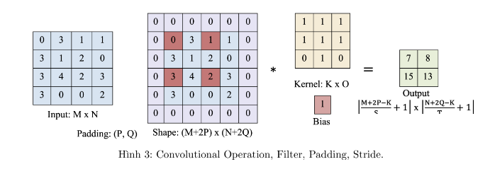
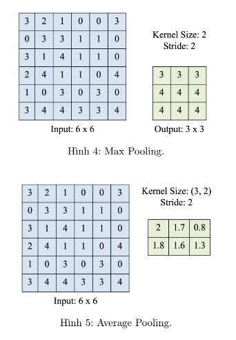
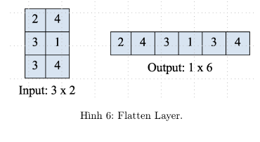

### Xử Lý Ảnh và Convolutional Neural Networks (CNN)

Trong xử lý ảnh, mỗi bức ảnh có hàng triệu pixels, và mỗi pixel được xem như một **feature**.  
Ví dụ: Với ảnh kích thước **1000x1000**, sẽ có **1.000.000 features**.

#### Vấn Đề Với Neural Networks Thông Thường

Neural network thông thường sử dụng **full-connected layers**:

- Mỗi pixel ở một layer kết nối với **tất cả pixels ở layer trước**.
- Với 1.000.000 pixels/layer, số tham số sẽ lên đến **\(10^{12}\)**.

Hệ quả:

- **Khó khăn trong tính toán** do số tham số quá lớn.
- **Dễ overfitting**, cần lượng lớn dữ liệu để training.
- Đòi hỏi nhiều **bộ nhớ** và **năng lực tính toán**.

#### Sự Ra Đời Của CNN

CNN được phát triển để giải quyết các vấn đề này hiệu quả hơn, dựa trên hai đặc tính của ảnh:

1. **Feature Localization**:  
   Mỗi pixel hoặc feature liên quan đến các pixel lân cận.

2. **Feature Independence of Location**:  
   Một feature vẫn giữ nguyên giá trị, bất kể vị trí của nó trong ảnh.

#### Các Cơ Chế Chính Của CNN

1. **Locally Connected Layers**:

   - Trong hidden layer đầu tiên, mỗi node chỉ kết nối với **một cụm nhỏ pixels** (small portion) của input image.
   - Điều này giúp giảm số lượng kết nối và tham số.

2. **Shared Parameters**:
   - Một số khu vực trong ảnh có thể dùng **chung bộ tham số** để phát hiện feature.
   - Ví dụ: Phía trên bên phải và phía dưới bên trái có thể sử dụng cùng một bộ tham số.

#### Lợi Ích của CNN

- **Giảm số lượng tham số**, từ đó hạn chế overfitting.
- **Tiết kiệm tài nguyên** tính toán và bộ nhớ.

### Các Thành Phần Chính Của CNN

CNN bao gồm 3 thành phần chính:

#### 1. **Convolution Layer**

- **Thành phần chính**:
  - **Filter (Kernel)**: Là một mạng locally connected, giúp học các feature trong ảnh.
  - **Padding**: Thêm giá trị padding index vào các hàng/cột ngoài cùng của ma trận ảnh đầu vào.
  - **Stride**: Bước nhảy của filter khi di chuyển quanh bức ảnh.
- **Hoạt động**: Filter quét qua ảnh, tạo ra các feature map để trích xuất đặc điểm.
  

#### 2. **Pooling Layer**

- **Loại chính**:
  - **Max-pooling**: Chọn giá trị lớn nhất từ mỗi cửa sổ tính toán.
  - **Average-pooling**: Tính giá trị trung bình của các giá trị trong mỗi kernel.
- **Chức năng**: Giảm kích thước dữ liệu (down-sampling) mà vẫn giữ được thông tin quan trọng.
  

#### 3. **Fully-Connected Layer**

- flatten convolution layer cuối cùng:
  - **Chức năng**: Duỗi (flatten) ma trận nhiều chiều từ convolution layer cuối cùng thành một vector.
  - **Kết nối**: Toàn bộ các neuron trong vector được fully connect với các neuron ở output layer.
  - **Vai trò**: Tổng hợp thông tin từ các feature đã học để đưa ra kết quả đầu ra.
    
