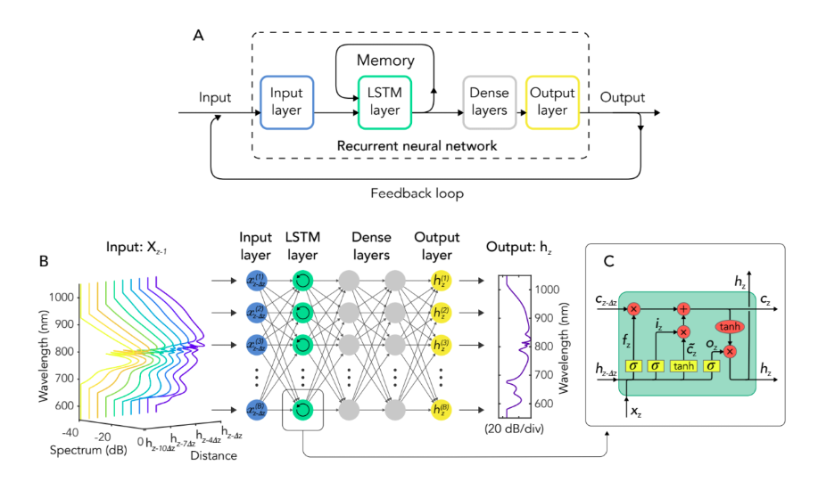

# Recurrent Neural Networks (RNNs)

- Điểm chung giữa dữ liệu dạng bảng và dữ liệu ảnh là chúng đều có số lượng đặc trưng (features) rõ ràng và cụ thể, chẳng hạn như số lượng thuộc tính trong dữ liệu bảng hoặc số lượng pixel của một bức ảnh (ví dụ: MNIST dataset chứa các hình ảnh có kích thước 28 x 28 pixel). 
- Đồng thời, các mô hình được thiết kế cho các tác vụ regression hoặc classification cho những dữ liệu trên thường nhận input là các features của một sample data và đưa ra dự đoán là một output đơn lẻ (ví dụ: phân loại hình ảnh chó hoặc mèo, dự đoán giá nhà, chẩn đoán bệnh, v.v.).
- Tuy nhiên, có rất nhiều tác vụ học khác mà chúng ta sẽ phải làm việc với các data có độ dài linh hoạt như text, audio, time series. Đồng thời các models thiết kế cho các tác vụ trên cũng yêu cầu sau khi nhận vào input là sequential data, output dự đoán cũng sẽ có dạng sequential. 
- Sẽ có nhiều sự thác mắc về việc như thế nào là data có fixed length và flexible length, khi mà ảnh cũng sẽ có nhiều ảnh lớn nhỏ, tabular data cũng sẽ có nhiều bảng với số lượng attribute khác nhau. Để hiểu rõ, chúng ta cần phân rõ sự khác biệt giữa chúng:
    - **Image data**: Ảnh có rất nhiều size khác nhau như 28x28, 32x32, 128x128, ... nhưng nhìn chung chúng ta đều có thể resize về một size nhất định phù hợp với cấu trúc mô hình.
    - **Tabular data**: Đối với cùng một mẫu, như chẩn đoán bệnh cho bệnh nhân, có thể sẽ có bệnh nhân có số lượng thông tin nhiều hơn hẳn bệnh nhân khác, nhưng chung quy chúng ta đều phải quy chúng về 1 bảng ( thực hiện feature engineering) và thực hiện dự đoán trên cùng một số lượng features nhất định.
    - **Sequential data**: Dữ liệu dạng chuỗi lại có tính chất rất khác so với 2 cái trên, khi mà từng mẫu có độ dài khác nhau, ví dụ như mỗi câu trong văn bản sẽ có độ dài khác nhau, việc chuẩn hóa (như padding, truncate) sẽ dẫn tới mất ngữ nghĩa hoặc tạo ra nhiễu.

