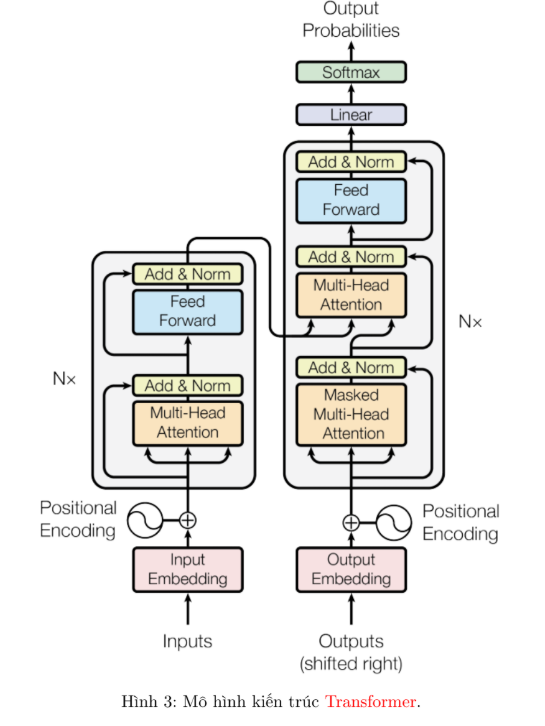

# Transformers


- Mô hình Transformer ra đời với kỹ thuật cốt lõi và cơ chế Attention, đã đạt được những kết quả ấn tượng cho các bài toán về dữ liệu văn bản rồi từ đó mở rộng cho các kiểu dữ liệu như hình ảnh và âm thanh,... Trong phần này, chúng ta sẽ tìm hiểu các thành phần trong mô hình Transformer và ứng dụng cho bài toán phân loại văn bản.

## 1. Kiến trúc Transformer


Kiến trúc Transformer gồm các thành phần:

- Input Embedding: Biểu diễn các token đầu vào (Thường được tách bởi Subword-based Tokenization) thành các dense vector.
- Positional Encoding: Biểu diễn vị trí (thứ tự) của các token trong câu. Thường được tính dựa vào hàm sinusoid hoặc được học trong quá trình huấn luyện mô hình.
- Các khối encoder: Để mã hoá các tokens đầu vào thành các contextual embedding. Bao gồm:
  - Multi-Head Attention
  - Add - Normalization
  - Feed Forward
- Các khối decoder: nhận input là các token lịch sử và trạng thái mã hoá từ encoder, giải mã dự đoán token tiếp theo. Gồm:
  - Masked Multi-Head Attention (dựa vào token lịch sử của decoder)
  - Multi-Head Attention(dựa vào encoder và trạng thái hiện tại decoder)
  - Add - Normalization
  - Feed Forward
- Language Model Head: Projection và Softmax dự đoán token tiếp theo vs xác suất lớn nhất.

### 1.1 Input Embedding, Positional Encoding
```python
class TokenAndPositionEmbedding(nn.Module):
    def __init__(self, vocab_size, embed_dim, max_length, device='cpu'):
        super().__init__()
        self.device = device
        self.word_emb = nn.Embedding(
            num_embeddings = vocab_size,
            embedding_dim = embed_dim
        )
        self.pos_emb = nn.Embedding(
            num_embeddings = max_length,
            embedding_dim = embed_dim
        )

    def forward(self, x):
        N, seq_len = x.size()
        positions = torch.arange(0, seq_len).expand(N, seq_len).to(self.device)
        output1 = self.word_emb(x)
        output2 = self.pos_emb(positions)
        output = output1 + output2
        return output
```

### 1.2 Encoder

```python
class TransformerEncoderBlock(nn.Module):
    def __init__(self, embed_dim, num_heads, ff_dim, dropout=0.1):
        super().__init__()
        self.attn = nn.MultiheadAttention(
            embed_dim,
            num_heads,
            batch_first=True
        )
        self.ffn = nn.Sequential(
            nn.Linear(in_features=embed_dim, out_features=ff_dim, bias=True),
            nn.ReLU(),
            nn.Linear(in_features=ff_dim, out_features=embed_dim, bias=True)
        )
        self.norm1 = nn.LayerNorm(embed_dim)
        self.norm2 = nn.LayerNorm(embed_dim)
        self.dropout1 = nn.Dropout(dropout)
        self.dropout2 = nn.Dropout(dropout)

    def forward(self, query, key, value):
        attn_output, attn_weights = self.attn(query, key, value)
        attn_output = self.dropout1(attn_output)
        out1 = self.norm1(query + attn_output)
        ffn_output = self.ffn(out1)
        ffn_output = self.dropout2(ffn_output)
        out2 = self.norm2(out1 + ffn_output)
        return out2

class TransformerEncoder(nn.Module):
    def __init__(self, src_vocab_size, embed_dim, max_length, num_layers, num_heads, ff_dim, dropout=0.1, device='cpu'):
        super().__init__()
        self.embedding = TokenAndPositionEmbedding(src_vocab_size, embed_dim, max_length, device)
        self.encoder_blocks = nn.ModuleList([
            TransformerEncoderBlock(embed_dim, num_heads, ff_dim, dropout)
            for _ in range(num_layers)
        ])

    def forward(self, x):
        x = self.embedding(x)
        for layer in self.encoder_blocks:
            x = layer(x, x, x)
        return x
```

### 1.3 Decoder

```python
class TransformerDecoderBlock(nn.Module):
    def __init__(self, embed_dim, num_heads, ff_dim, dropout=0.1):
        super().__init__()
        self.attn = nn.MultiheadAttention(
            embed_dim,
            num_heads,
            batch_first=True
        )
        self.cross_attn = nn.MultiheadAttention(
            embed_dim,
            num_heads,
            batch_first=True
        )
        self.ffn = nn.Sequential(
            nn.Linear(in_features=embed_dim, out_features=ff_dim, bias=True),
            nn.ReLU(),
            nn.Linear(in_features=ff_dim, out_features=embed_dim, bias=True)
        self.norm1 = nn.LayerNorm(normalized_shape=embed_dim, eps=1e-6)
        self.norm2 = nn.LayerNorm(normalized_shape=embed_dim, eps=1e-6)
        self.norm3 = nn.LayerNorm(normalized_shape=embed_dim, eps=1e-6)
        self.dropout1 = nn.Dropout(p=dropout)
        self.dropout2 = nn.Dropout(p=dropout)
        self.dropout3 = nn.Dropout(p=dropout)

    def forward(self, x, enc_output, src_mask, tgt_mask):
        attn_output = self.attn(x, x, x, attn_mask=tgt_mask)
        attn_output = self.dropout1(attn_output)
        out1 = self.norm1(x + attn_output)
        cross_attn_output = self.cross_attn(out1, enc_output, enc_output, attn_mask=src_mask)
        cross_attn_output = self.dropout2(cross_attn_output)
        out2 = self.norm2(out1 + cross_attn_output)
        ffn_output = self.ffn(out2)
        ffn_output = self.dropout3(ffn_output)
        out3 = self.norm3(out2 + ffn_output)
        return out3

class TransformerDecoder(nn.Module):
    def __init__(
        self,
        tgt_vocab_size,
        embed_dim,
        max_length,
        num_layers,
        num_heads,
        ff_dim,
        dropout=0.1,
        device='cpu'
    ):
        super().__init__()
        self.embedding = TokenAndPositionEmbedding(tgt_vocab_size, embed_dim, max_length, device)
        self.layers = nn.ModuleList([
            TransformerDecoderBlock(embed_dim, num_heads, ff_dim, dropout)
            for _ in range(num_layers)
        ])

    def forward(self, x, enc_output, src_mask, tgt_mask):
        x = self.embedding(x)
        for layer in self.layers:
            x = layer(x, enc_output, src_mask, tgt_mask)
        return x
```

### 1.4 Transformer Model

```python
class Transformer(nn.Module):
    def __init__(
        self, 
        src_vocab_size, 
        tgt_vocab_size, 
        embed_dim, 
        max_length, 
        num_layers, 
        num_heads,
        ff_dim,
        dropout=0.1,
        device='cpu',
    ):
        super().__init__()
        self.device = device
        self.encoder = TransformerEncoder(
            src_vocab_size,
            embed_dim,
            max_length,
            num_layers,
            num_heads,
            ff_dim,
            dropout,
            device
        )
        self.decoder = TransformerDecoder(
            tgt_vocab_size,
            embed_dim,
            max_length,
            num_layers,
            num_heads,
            ff_dim,
            dropout,
            device
        )
        self.projection = nn.Linear(embed_dim, tgt_vocab_size, bias=False)

    def generate_mask(self, src, tgt):
        src_seq_len = src.shape[1]
        tgt_seq_len = tgt.shape[1]
        src_mask = torch.zeros((src_seq_len, src_seq_len), device=self.device).type(torch.bool)
        tgt_mask = (torch.triu(torch.ones((tgt_seq_len, tgt_seq_len), device=self.device)) == 1).transpose(0, 1) # transpose: (0, 1) là chuyển vị
        tgt_mask = tgt_mask.float().masked_fill(tgt_mask == 0, float('-inf')).masked_fill(tgt_mask == 1, float(0.0))
        return src_mask, tgt_mask

    def forward(self, src, tgt):
        src_mask, tgt_mask = self.generate_mask(src, tgt)
        enc_output = self.encoder(src)
        dec_output = self.decoder(tgt, enc_output, src_mask, tgt_mask)
        output = self.projection(dec_output)
        return output
```

### 1.5 Test

```python
batch_size = 128
src_vocab_size = 1000
tgt_vocab_size = 2000
embed_dim = 200
max_length = 100
num_layers = 2
num_heads = 4
ff_dim = 256

model = Transformer (
    src_vocab_size , tgt_vocab_size ,
    embed_dim , max_length , num_layers , num_heads , ff_dim
)

src = torch.randint(
    high = 2,
    size = (batch_size, max_length),
    dtype = torch.int64
)

tgt = torch.randint(
    high = 2,
    size = (batch_size, max_length),
    dtype = torch.int64
)

prediction = model(src, tgt)
prediction.shape # batch_size x max_length x tgt_vocab_size
```

