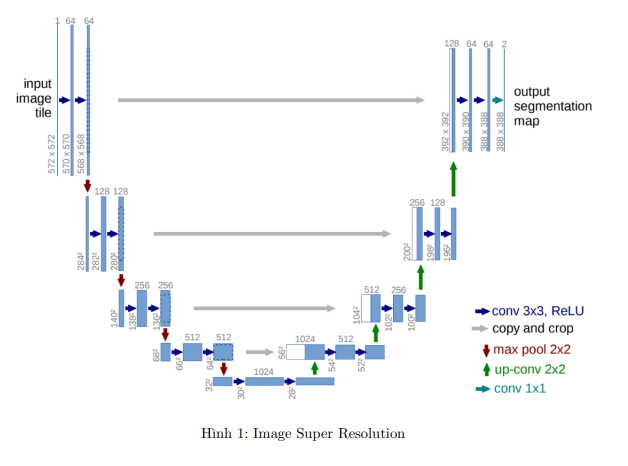
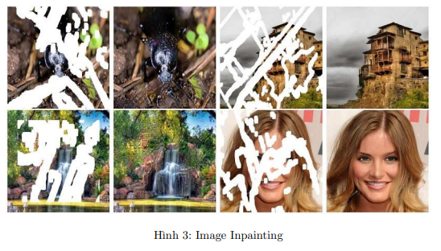

# Kỹ Thuật Xử Lý Ảnh AI

## U-Net
U-Net là mạng nơ-ron tích chập được phát triển năm 2015, chuyên dụng cho phân đoạn ảnh (image segmentation).

### Đặc điểm chính:
- Kiến trúc: Mô hình Encoder-Decoder với skip connections
- Ứng dụng: Phân đoạn ảnh y tế, phân đoạn đối tượng độ phân giải cao
- Kích hoạt: Sử dụng hàm ReLU (Rectified Linear Unit)
- Ưu điểm: Skip connections tạo đường dẫn ngắn từ đầu vào đến đầu ra, giúp bảo toàn thông tin chi tiết

## Super Resolution (SISR)
SISR là kỹ thuật nâng cao độ phân giải của ảnh đơn lẻ.

### Đặc điểm chính:
- Mục tiêu: Chuyển đổi ảnh độ phân giải thấp thành ảnh độ phân giải cao
- Dữ liệu huấn luyện: Cặp ảnh độ phân giải cao (HR) và thấp (LR)
- Công thức: $I_{SR}=F(I_x; \theta_F)$
  - F: Super resolution model
  - $\theta_F$: Tham số của model
  - $I_x$: Ảnh đầu vào độ phân giải thấp

### Phương pháp:
- Nội suy truyền thống:
  - Nearest-neighbor Interpolation
  - Bilinear Interpolation
  - Bicubic Interpolation
- So sánh với MISR/VSR:
  - SISR khó hơn do chỉ có một ảnh đầu vào
  - MISR/VSR có thông tin từ nhiều ảnh/video, cho kết quả tốt hơn

## Image Inpainting
Kỹ thuật khôi phục các phần bị thiếu hoặc che khuất trong ảnh.

### Đặc điểm chính:
- Phương pháp: Dự đoán pixel dựa trên ngữ cảnh xung quanh
- Đầu vào: Ảnh gốc + mask (4 kênh)
- Quy trình: Có thể thực hiện một hoặc hai giai đoạn
- Yếu tố quan trọng: Thông tin ngữ cảnh xung quanh vùng cần khôi phục